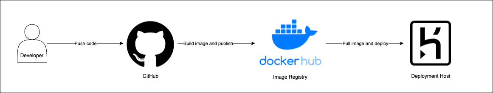
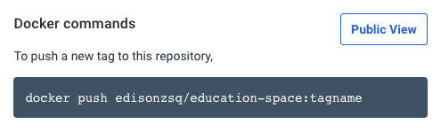
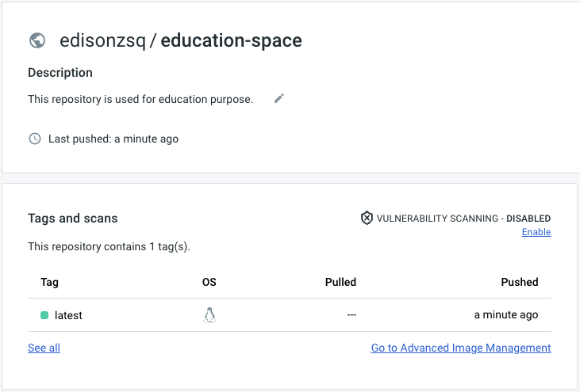

## Brief

### Preparation

Docker Hub account is needed and integrated with Docker Desktop.

### Lesson Overview

In the previous lesson, learners started learning about containerization and hosting a docker container locally. Learners have also experienced what it meant by building images and deploying them locally using `docker run`. In this lesson, learners will go deeper into understanding Cloud Native App and Container Registry. By the end of this lesson, learners would have attempted pushing and pulling images to and fro the container registry.

This lesson is essential when we move towards learning CI/CD Pipeline using containerization.

---

## Self Studies Check-installations

**Q1: Which of the following describes the Cloud Native App?**

A - Cloud native applications are independent services, packaged as self-contained, lightweight containers that are portable and can be scaled (in or out) rapidly based on the demand.

B - They are microservices and serverless functions.

C - They are delivered with CI/CD toolchains.

D - All of the above


**Q2: Which of the following is NOT a benefit of Cloud Native App?**

A - It makes event driven architecture possible.

B - It maximizes the benefits that cloud brings.

C - It is typically smaller than traditional app and it makes deployment easier.

D - It allows software update without with zero downtime.

---

## Part 1 - Principles of Cloud Native App

The quick answer to *What is considered as Cloud Native App?* is that it should either be `deployed as container` or `serverless`. This is half true because there are qualities in how "cloud native" your application is. To migrate a traditional software into cloud native applications is not easy feat. Some migrations can take months and years to complete. 

Instead of nailing the *practical outcomes* such as containerization/serverless. Let us focus on understanding the *principles* of cloud native app. As a Cloud/DevOps Engineer, the details of how the software is written may not be your top priority. However, it is important for you to learn to discern how ready is a piece of software to be cloud native.

### *Activity - Group Research*

Form at least seven groups and each group shouuld take on one principle listed [here](https://www.ibm.com/cloud/architecture/architecture/practices/cloud-native-principles/) for some research. You should write your conclusion as a group in your own words.

|# Principle| Your Explanation |
|-|-|
|1. Single Concern|Your input|
|2. High Observability|Your input|
|3. Lifecycle Conformance|Your input|
|4. Image Immutability|Your input|
|5. Process Disposability|Your input|
|6. Self Containment|Your input|
|7. Runtime Confinement|Your input|

> These principles may not be straight forward to understand. Encourage more read up, spar thoughts among team members to sharpen each other.

---

## Part 2 - What is Container Image Registry

> Answer: Container Registry is a service for storing private container images.

Consider this logical diagram flow:



1. Developers push code to the code version control system called GitHub
2. When code changes are detected in the GitHub, the system would:
    - Clone the repository
    - Perform image build
    - Publish image to image registry
3. When the deployment step is triggered, it would pull the image from registry and deploy it.


### *Activity - Brainstorming*

The traditional deployment approach requires the IT Operations Team to bring the source code to deploy them into the hosting servers directly. How has containerization changed the way we approach deployment?

---

## Part 3 - Push Image to Registry

In this section, you will utilize the `docker push` and `docker pull` command to manage images in Docker Hub Repository.

### Accounts Creation

Step 1: Go to [Docker Hub](https://hub.docker.com/) to register a new account, or sign in to existing account.

Step 2: Ensure that your Docker Desktop is signed in to the Docker Hub. Go to Docker Dashboard > Images > Remote Repositories to sign in.

### Create Docker Hub Registry

Step 1: In your Docker Hub, click on "Create Repository".

Step 2: Name the repository `education-space`, insert any description and select "public" repository.

Step 3: Once the registry is created, you will notice an instruction on the right that indicate you must push your image based on this convention: `your_username/repository_name:tagname`. 



### Tag Image and Push

You need your image name to follow the convention `your_username/repository_name` to be able to push to the remote repository. You can either build from `Dockerfile` from scratch and name your `-t` options appropriately, or you may re-tag existing image.

For example, if I already have an image `apple:latest`, I can tag this image by entering the command:

```sh
docker image tag apple:latest edisonzsq/education-space:latest
```

Then, push this image to the registry with:

```sh
docker push edisonzsq/education-space:latest
```

and I should see a new image recorded on my Docker Hub.



If you do not wish to use `docker image tag` command, you would simply build a new image through `Dockerfile` using:

```sh
docker build -t edisonzsq/education-space:latest .
```

> In production, it is generally a bad idea to tag `:latest` for every image you publish. The tag would typically reflect semenatic versioning convention such as `:1.0.0`. 